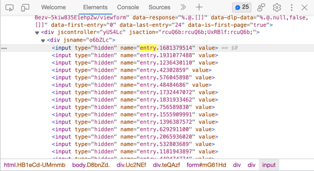

[](https://opensource.org/licenses/MIT)

# Wolffun Runtime Profiler

Một công cụ tự động thu thập các dữ liệu phản ánh hiệu năng của ứng dụng và đẩy dữ liệu lên Google Sheets. Với dữ liệu này bạn có thể theo dõi sức khỏe hiệu năng game của bạn thường xuyên, cung cấp cho QA team dữ liệu để test hiệu năng dễ dàng hơn.

- [Cách sử dụng](#cách-sử-dụng)
- [Cài đặt](#cai-dat)
  - [Thông qua git tag](#thông-qua-git-tag)
- [Cấu hình](#cấu-hình)

<!-- toc -->

## Cách sử dụng
### Setup
1. Gắn script PerformanceTracker và LoadingTimeTracker vào một GameObject. 
2. Nếu bạn cần theo dõi thông số qua nhiều scene khác nhau, bạn nên để GameObject đó DontDestroyOnload. Hoặc tick vào checkbox Dont Destroy Onload trong script PerformanceTracker/LoadingTimeTracker trên Inspector.
### Cách dùng API
```csharp
//Start your measure performance data using
PerformanceTracker.StartMeasure("your_feature_to_be_measure"); 
//Stop your measure performance data using
PerformanceTracker.StopMeasure("your_feature_to_be_measure"); 

//Start measure loading time using
LoadingTimeTracker.Start("your_feature_to_be_measure");
//Stop measure loading time using
LoadingTimeTracker.Stop("your_feature_to_be_measure");

```

## Cài đặt

### Thông qua git tag

Mở file `Packages/manifest.json` bằng một phần mềm chỉnh sửa text bất kỳ. Thêm dòng dưới đây vào dependencies block, nhớ thay phiên bản bằng phiên bản bạn muốn cài.
```json
{
  "dependencies": {
    "com.wolffun.runtimeprofiler": "https://github.com/WolffunGame/RuntimeProfiler.git#1.0.0"
  }
}
```

## Cấu hình

Một Scriptable Object tự động được tạo ở Assets/Resources/RuntimeProfiler/GoogleFormConfig.asset.
Ta cần điền các cấu hình vào GoogleFormConfig, bao gồm url và các entry.
Để lấy url bạn cần tạo một Google Form, tạo các trường để nhập các dữ liệu của Runtime Profiler.
Để lấy các entry, bạn click chuột phải vào một trường của Google Form ở trạng thái preview, chọn Inspect. Tìm kiếm từ khóa "entry." và copy các entry vào GoogleFormConfig. Các entry từ trên xuống lần lượt với từng trường trong form. Giá trị cần lấy ví dụ như "entry.12345679".


## License

MIT License

Copyright © 2023 Wolffun Game
